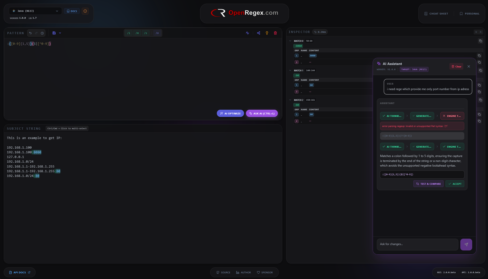
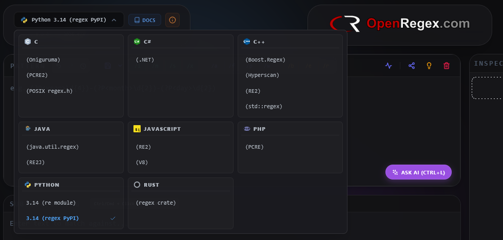
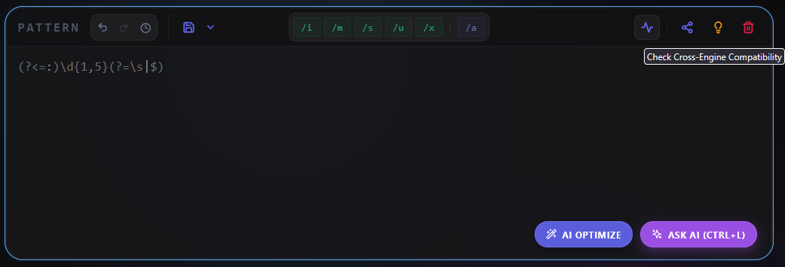
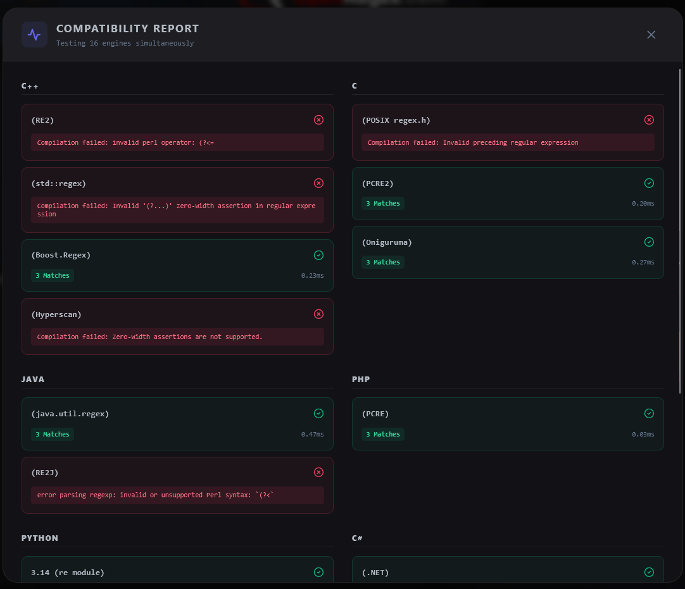
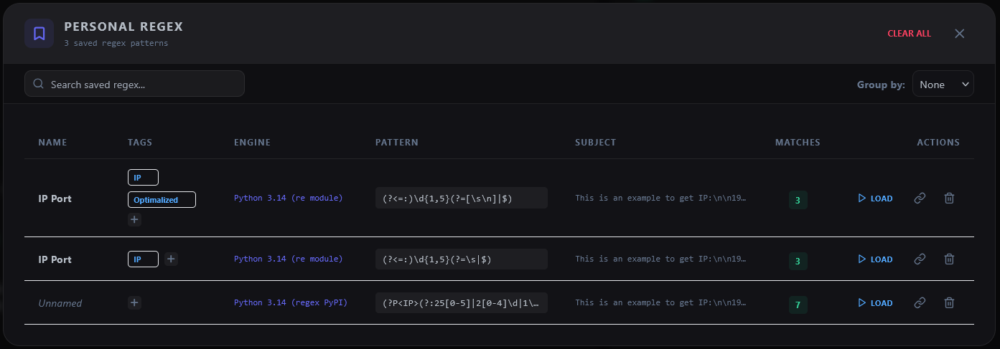
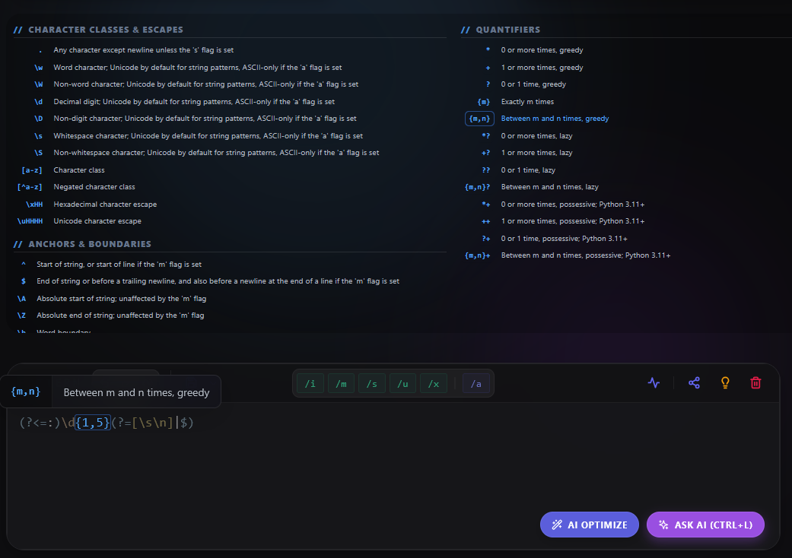
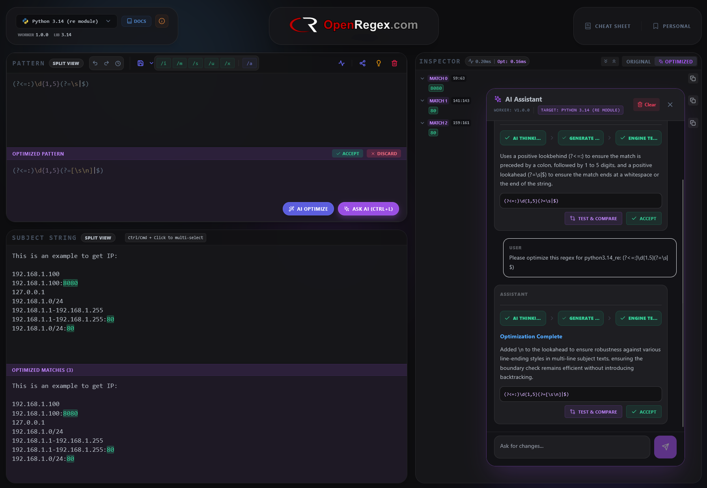
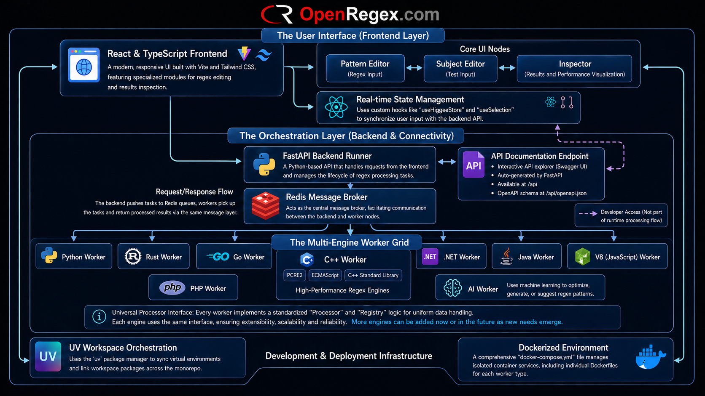

<div align="center">
  
  <br>
  
</div>

Official website: **[OpenRegex.com](https://www.openregex.com)**

[]()

OpenRegex is a unified, open-source platform for testing, debugging, and analyzing regular expressions within isolated
runtimes (Runtime-as-a-Service). It provides developers with a tool that guarantees 100% result consistency with the
target production environment, eliminating the discrepancies between native regex dialects.

<div align="center">
  
</div>

---

## 🌟 Key Features

* **Polyglot Micro-Workers:** Native engine execution via completely isolated Docker containers.
* **Pattern Inspector:** Advanced React + Vite frontend for dynamic visual match inspection and group highlighting.
* **AI-Powered Assistant (`worker-ai`):** An optional, independent worker using separate queues designed specifically
  for regex.
  It automatically generates complex patterns from natural language prompts, explains obscure syntax, and optimizes
  inefficient queries. **🛡️ Security Note:** For production deployments, it is highly recommended to route requests
  through an LLM proxy server (like **LiteLLM**) to safely manage and isolate your API keys rather than exposing them
  directly to the worker environment.
* **Zero-Trust Guardrails:** 1000ms SLA (engine-dependent overrides possible), strict memory limits (e.g., 8MB heap
  limits for binary
  engines), and multiprocessing isolation to prevent ReDoS attacks.
* **Living Docs System:** Dynamic knowledge base featuring context-aware cheat sheets and engine-specific trivia (
  Factograph).
* **Smart Discovery:** Automatic heartbeat registration of worker node capabilities via Redis.

---

## 🖼️ Feature Showcase

### Multi Regex Engine Selection
Run patterns across multiple engines and compare results instantly.



---

### Cross-Engine Compatibility Report
Detect inconsistencies and portability issues between engines.


<br>

---

### Personal Storage
Store and manage regex patterns locally in your browser.



---

### Advanced Hint System
Hover tokens to get instant explanations.



---

### AI Optimization
Generate, explain, and optimize regex patterns.



---

## 🏗️ Architecture & Internal Design

OpenRegex is built on strict architectural guidelines to ensure high performance and maintainability. Detailed technical
specifications can be found in the `docs/` directory.

### Worker Node Architecture (`docs/WorkerNodeArchitecture.md`)

All worker nodes must interface with a Redis-backed queue system and adhere to strict execution SLAs.

* **Persistent Execution:** Workers must not incur process startup overhead per request, keeping execution engines hot
  in memory.
* **Concurrent Polling:** The Redis queue polling mechanism (`BRPOP`) is completely decoupled from the regex execution
  block to allow concurrent task processing.
* **Claim-Check Pattern:** To bypass message broker memory limits, workers intercept large subject texts stored
  temporarily in Redis using a `text_payload_id`.
* **ReDoS Guardrails:** Every regex execution must be strictly bounded by a 1000ms SLA; if an engine hangs, it
  is safely terminated.
* **Data Contracts:** Communication relies on strict JSON payloads over Redis, utilizing `MatchRequest` inbound tasks
  and `MatchResult` outbound tasks over Pub/Sub.

### Frontend Architecture (`docs/FrontendArchitecture.md`)

The React + Vite frontend uses a domain-driven, feature-based architecture to maintain a clean codebase.

* **The Dependency Rule:** The `features/` directory must never import from other `features/`, ensuring isolated
  modules. Both `core/` and `shared/` directories can only import from themselves or external packages.
* **State Management:** Business logic and global state are never passed as props. Shared state belongs in `core/store/`
  using Zustand with atomic selectors, while local UI state uses standard React `useState`.
* **Feature Encapsulation:** All components, hooks, types, and utilities specific to a feature are kept inside its
  respective folder and exposed only through a top-level `index.ts` file.

---

## ⚙️ Core Infrastructure

| Component                | Role                 | Tech Stack                                                                             | Version                                                                                                                                                                                                  | Downloads                                                                       |
|:-------------------------|:---------------------|:---------------------------------------------------------------------------------------|:---------------------------------------------------------------------------------------------------------------------------------------------------------------------------------------------------------|:--------------------------------------------------------------------------------|
| **Frontend**             | `openregex-frontend` | React + Vite UI. Handles visualization, and worker health monitoring.                  | []([https://hub.docker.com/r/sunnev/openregex-frontend/tags](https://hub.docker.com/r/sunnev/openregex-frontend/tags)) |   |
| **Backend**              | `openregex-backend`  | API Orchestrator. Manages Redis job queues, worker discovery, and security guardrails. | [](https://hub.docker.com/r/sunnev/openregex-backend/tags)                                                              |    |
| **AI Worker** (Optional) | `worker-ai`          | LLM-powered Regex assistant. Generates, explains, and optimizes complex patterns.      | [](https://hub.docker.com/r/sunnev/openregex-worker-ai/tags)                                                          |  |

---

## 🚀 Engine Matrix

| Worker Image    | Engine ID         | Algorithm      | Features & Use Case                                        | Version                                                                                                                                                           | Downloads                                                                           |
|:----------------|:------------------|:---------------|:-----------------------------------------------------------|:------------------------------------------------------------------------------------------------------------------------------------------------------------------|:------------------------------------------------------------------------------------|
| `worker-python` | `python*_re`      | NFA            | Standard `re` module. Susceptible to ReDoS.                | [](https://hub.docker.com/r/sunnev/openregex-worker-python/tags) |  |
| `worker-python` | `python*_regex`   | NFA (Advanced) | PyPI `regex` module. Variable lookbehinds, fuzzy matching. | [](https://hub.docker.com/r/sunnev/openregex-worker-python/tags) |  |
| `worker-c-cpp`  | `cpp_re2`         | DFA            | Google RE2. Guaranteed $O(n)$ time, ReDoS-safe.            | [](https://hub.docker.com/r/sunnev/openregex-worker-c-cpp/tags)   |   |
| `worker-c-cpp`  | `cpp_std`         | NFA            | Standard C++11 `std::regex`. ECMAScript default.           | [](https://hub.docker.com/r/sunnev/openregex-worker-c-cpp/tags)   |   |
| `worker-c-cpp`  | `cpp_boost`       | NFA (Advanced) | Boost.Regex. PCRE syntax, recursive patterns.              | [](https://hub.docker.com/r/sunnev/openregex-worker-c-cpp/tags)   |   |
| `worker-c-cpp`  | `cpp_hyperscan`   | DFA/Automata   | Intel Hyperscan. High-performance stream scanning.         | [](https://hub.docker.com/r/sunnev/openregex-worker-c-cpp/tags)   |   |
| `worker-c-cpp`  | `c_pcre2`         | NFA/JIT        | PCRE2 library. Industry standard for Perl-compatibility.   | [](https://hub.docker.com/r/sunnev/openregex-worker-c-cpp/tags)   |   |
| `worker-c-cpp`  | `c_onig`          | NFA            | Oniguruma. Used in VS Code, supports multi-encoding.       | [](https://hub.docker.com/r/sunnev/openregex-worker-c-cpp/tags)   |   |
| `worker-c-cpp`  | `c_posix`         | NFA            | POSIX `regex.h`. Standard libc implementation (ERE).       | [](https://hub.docker.com/r/sunnev/openregex-worker-c-cpp/tags)   |   |
| `worker-dotnet` | `dotnet_standard` | NFA (Advanced) | `System.Text.RegularExpressions`. Balancing groups.        | [](https://hub.docker.com/r/sunnev/openregex-worker-dotnet/tags) |  |
| `worker-go`     | `go_standard`     | DFA            | Standard `regexp` package. ReDoS-safe, linear time.        | [](https://hub.docker.com/r/sunnev/openregex-worker-go/tags)         |      |
| `worker-jvm`    | `jvm_standard`    | NFA            | Standard `java.util.regex`. Backtracking engine.           | [](https://hub.docker.com/r/sunnev/openregex-worker-jvm/tags)       |     |
| `worker-jvm`    | `jvm_re2j`        | DFA            | Google's RE2J. Guaranteed $O(n)$ execution, ReDoS-safe.    | [](https://hub.docker.com/r/sunnev/openregex-worker-jvm/tags)       |     |
| `worker-rust`   | `rust_standard`   | DFA            | Rust `regex` crate. Linear time $O(n)$, ReDoS-safe.        | [](https://hub.docker.com/r/sunnev/openregex-worker-rust/tags)     |    |
| `worker-v8`     | `v8_standard`     | NFA            | Native Node.js RegExp. Supports modern `v` flag.           | [](https://hub.docker.com/r/sunnev/openregex-worker-v8/tags)         |      |
| `worker-php`    | `php_pcre`        | NFA            | PHP `preg_*` functions. PCRE2 based.                       | [](https://hub.docker.com/r/sunnev/openregex-worker-php/tags)       |     |

---

## 📡 System Topology

<div align="center">
  
</div>

OpenRegex utilizes a microservices architecture managed via UV Workspaces:

1. **OpenRegex Backend (FastAPI):** Central API hub routing traffic using "Smart Discovery".
2. **OpenRegex Frontend (React + Vite):** The visual inspector UI.
3. **Redis Backbone:** Message broker handling task queues (`queue:{family}`) and result pub/sub channels (
   `result:{task_id}`).
4. **Worker Isolators:** Isolated worker nodes (Python, C++, Java, etc.) executing sub-processes for exact native regex
   behaviors.

---

## 🛠️ Installation & Deployment

OpenRegex 2.0 is fully containerized. You no longer need to manually install compilers or runtimes on your host machine.

### Prerequisites

* Docker & Docker Compose
* Git

### Quick Start

1. **Clone the repository:**
   ```bash
   git clone [https://github.com/sunnev/openregex.git](https://github.com/sunnev/openregex.git)
   cd openregex
   ```

2. **Set up the Environment File:**
   ```bash
   cp .env.example .env
   ```

3. **Start the Development Environment:**

   **On Windows:**
   ```cmd
   .\deploy\run_deploy.bat
   ```
   **On Linux/macOS:**
   ```bash
   docker-compose -f deploy/docker-compose.yml --env-file .env down -v
   docker-compose -f deploy/docker-compose.yml --env-file .env up --build -d
   ```

4. **Access the Application:**
   Open your browser and navigate to `http://localhost:5000`. The FastAPI backend will be available at
   `http://localhost:8000`.

---

### 📝 Environment Configuration (`.env`)

To customize your OpenRegex deployment, you can configure various parameters in your `.env` file. Below is a breakdown
of the available settings to manage SEO, rate limits, AI worker parameters, and strict execution boundaries:

| Environment Variable              | Default Value                 | Explanation                                                                                                    |
|:----------------------------------|:------------------------------|:---------------------------------------------------------------------------------------------------------------|
| **`ROBOTS_META`**                 | `"noindex, nofollow"`         | Controls search engine indexing for production environments. Set to `"index, follow"` to make the site public. |
| **`RATE_LIMIT_REQUESTS`**         | `60`                          | The maximum number of requests allowed per engine per minute to prevent abuse.                                 |
| **`RATE_LIMIT_WINDOW`**           | `60`                          | The time window (in seconds) for the rate-limiting threshold.                                                  |
| **`API_AI_ENDPOINT_ENABLE`**      | `"false"`                     | Toggles the availability of the AI assistant endpoint (`worker-ai`).                                           |
| **`API_REGEX_ENDPOINT_ENABLE`**   | `"true"`                      | Toggles the core regex evaluation endpoint.                                                                    |
| **`AI_MAX_WORKERS`**              | `"2"`                         | The maximum number of concurrent AI worker processes.                                                          |
| **`LLM_ENDPOINT`**                | `"https://api.openai.com/v1"` | The base URL for the LLM service. Can be pointed to a proxy like LiteLLM.                                      |
| **`LLM_MODEL`**                   | `"gpt-4o"`                    | The specific LLM model used for generating, explaining, and optimizing patterns.                               |
| **`LLM_API_KEY`**                 | `"sk-..."`                    | Your secret API key for the chosen LLM provider.                                                               |
| **`LLM_SSL_VERIFY`**              | `"true"`                      | Determines whether SSL certificates should be verified when communicating with the LLM endpoint.               |
| **`WORKER_EXECUTION_TIMEOUT_MS`** | `1000`                        | The strict execution SLA (in milliseconds) applied across all regex workers to prevent ReDoS attacks.          |
| **`WORKER_MAX_INPUT_SIZE`**       | `10485760`                    | The maximum allowed length (10MB) for the subject text being tested.                                           |
| **`WORKER_MAX_MATCHES`**          | `10000`                       | The upper limit on the number of individual matches returned by the engine.                                    |
| **`WORKER_MAX_GROUPS`**           | `1000`                        | The maximum number of capture groups processed per request.                                                    |
| **`WORKER_MAX_JSON_SIZE`**        | `10485760`                    | The maximum allowed size (10MB) for JSON payloads communicated over the Redis backbone.                        |

## 🐳 Self-Hosting with Docker Compose

OpenRegex is designed to be easily self-hosted. Using Docker Compose, you can spin up the entire ecosystem—including the
orchestration backend, the visual frontend, and the polyglot worker nodes—with a single command.

Save the following configuration as `docker-compose.yml` and run `docker-compose up -d` to deploy.

```yaml
version: "3.8"

services:
  redis:
    image: redis:alpine
    healthcheck:
      test: [ "CMD", "redis-cli", "ping" ]
      interval: 5s
      timeout: 3s
      retries: 5
    restart: always

  backend:
    image: sunnev/openregex-backend:latest
    ports:
      - "8000:8000"
    environment:
      - REDIS_URL=redis://redis:6379
      - RATE_LIMIT_REQUESTS=${RATE_LIMIT_REQUESTS:-60}
      - RATE_LIMIT_WINDOW=${RATE_LIMIT_WINDOW:-60}
      - API_AI_ENDPOINT_ENABLE=${API_AI_ENDPOINT_ENABLE:-false}
      - API_REGEX_ENDPOINT_ENABLE=${API_REGEX_ENDPOINT_ENABLE:-true}
    depends_on:
      redis:
        condition: service_healthy
    restart: always

  frontend:
    image: sunnev/openregex-frontend:latest
    ports:
      - "5000:5000"
    environment:
      - ROBOTS_META=${ROBOTS_META:-noindex, nofollow}
    restart: always
    depends_on:
      - backend

  # --- OPTIONAL AI WORKER ---
  # Uncomment the lines below to enable LLM-powered regex assistance.
  # 🛡️ SECURITY RECOMMENDATION: For production, we strongly advise pointing LLM_ENDPOINT
  # to a proxy server (like LiteLLM) to safely manage and isolate your API keys.
  # worker-ai:
  #   image: sunnev/openregex-worker-ai:latest
  #   environment:
  #     - REDIS_URL=redis://redis:6379
  #     - LLM_ENDPOINT=${LLM_ENDPOINT:-}
  #     - LLM_MODEL=${LLM_MODEL:-}
  #     - LLM_API_KEY=${LLM_API_KEY:-}
  #     - LLM_SSL_VERIFY=${LLM_SSL_VERIFY:-true}
  #   depends_on:
  #     redis:
  #       condition: service_healthy
  #   restart: always

  worker-python:
    image: sunnev/openregex-worker-python:latest
    environment:
      - REDIS_URL=redis://redis:6379
      - WORKER_EXECUTION_TIMEOUT_MS=${WORKER_EXECUTION_TIMEOUT_MS:-1000}
      - WORKER_MAX_INPUT_SIZE=${WORKER_MAX_INPUT_SIZE:-10485760}
      - WORKER_MAX_MATCHES=${WORKER_MAX_MATCHES:-10000}
      - WORKER_MAX_GROUPS=${WORKER_MAX_GROUPS:-1000}
      - WORKER_MAX_JSON_SIZE=${WORKER_MAX_JSON_SIZE:-10485760}
    depends_on:
      redis:
        condition: service_healthy
    restart: always

  worker-c-cpp:
    image: sunnev/openregex-worker-c-cpp:latest
    environment:
      - REDIS_URL=redis://redis:6379
      - WORKER_EXECUTION_TIMEOUT_MS=${WORKER_EXECUTION_TIMEOUT_MS:-1000}
      - WORKER_MAX_INPUT_SIZE=${WORKER_MAX_INPUT_SIZE:-10485760}
      - WORKER_MAX_MATCHES=${WORKER_MAX_MATCHES:-10000}
      - WORKER_MAX_GROUPS=${WORKER_MAX_GROUPS:-1000}
      - WORKER_MAX_JSON_SIZE=${WORKER_MAX_JSON_SIZE:-10485760}
    depends_on:
      redis:
        condition: service_healthy
    restart: always

  worker-v8:
    image: sunnev/openregex-worker-v8:latest
    environment:
      - REDIS_URL=redis://redis:6379
      - WORKER_EXECUTION_TIMEOUT_MS=${WORKER_EXECUTION_TIMEOUT_MS:-1000}
      - WORKER_MAX_INPUT_SIZE=${WORKER_MAX_INPUT_SIZE:-10485760}
      - WORKER_MAX_MATCHES=${WORKER_MAX_MATCHES:-10000}
      - WORKER_MAX_GROUPS=${WORKER_MAX_GROUPS:-1000}
      - WORKER_MAX_JSON_SIZE=${WORKER_MAX_JSON_SIZE:-10485760}
    depends_on:
      redis:
        condition: service_healthy
    restart: always

  worker-jvm:
    image: sunnev/openregex-worker-jvm:latest
    environment:
      - REDIS_URL=redis://redis:6379
      - WORKER_EXECUTION_TIMEOUT_MS=${WORKER_EXECUTION_TIMEOUT_MS:-1000}
      - WORKER_MAX_INPUT_SIZE=${WORKER_MAX_INPUT_SIZE:-10485760}
      - WORKER_MAX_MATCHES=${WORKER_MAX_MATCHES:-10000}
      - WORKER_MAX_GROUPS=${WORKER_MAX_GROUPS:-1000}
      - WORKER_MAX_JSON_SIZE=${WORKER_MAX_JSON_SIZE:-10485760}
    depends_on:
      redis:
        condition: service_healthy
    restart: always

  worker-rust:
    image: sunnev/openregex-worker-rust:latest
    environment:
      - REDIS_URL=redis://redis:6379
      - WORKER_EXECUTION_TIMEOUT_MS=${WORKER_EXECUTION_TIMEOUT_MS:-1000}
      - WORKER_MAX_INPUT_SIZE=${WORKER_MAX_INPUT_SIZE:-10485760}
      - WORKER_MAX_MATCHES=${WORKER_MAX_MATCHES:-10000}
      - WORKER_MAX_GROUPS=${WORKER_MAX_GROUPS:-1000}
      - WORKER_MAX_JSON_SIZE=${WORKER_MAX_JSON_SIZE:-10485760}
    depends_on:
      redis:
        condition: service_healthy
    restart: always

  worker-dotnet:
    image: sunnev/openregex-worker-dotnet:latest
    environment:
      - REDIS_URL=redis://redis:6379
      - WORKER_EXECUTION_TIMEOUT_MS=${WORKER_EXECUTION_TIMEOUT_MS:-1000}
      - WORKER_MAX_INPUT_SIZE=${WORKER_MAX_INPUT_SIZE:-10485760}
      - WORKER_MAX_MATCHES=${WORKER_MAX_MATCHES:-10000}
      - WORKER_MAX_GROUPS=${WORKER_MAX_GROUPS:-1000}
      - WORKER_MAX_JSON_SIZE=${WORKER_MAX_JSON_SIZE:-10485760}
    depends_on:
      redis:
        condition: service_healthy
    restart: always

  worker-php:
    image: sunnev/openregex-worker-php:latest
    environment:
      - REDIS_URL=redis://redis:6379
      - WORKER_EXECUTION_TIMEOUT_MS=${WORKER_EXECUTION_TIMEOUT_MS:-1000}
      - WORKER_MAX_INPUT_SIZE=${WORKER_MAX_INPUT_SIZE:-10485760}
      - WORKER_MAX_MATCHES=${WORKER_MAX_MATCHES:-10000}
      - WORKER_MAX_GROUPS=${WORKER_MAX_GROUPS:-1000}
      - WORKER_MAX_JSON_SIZE=${WORKER_MAX_JSON_SIZE:-10485760}
    depends_on:
      redis:
        condition: service_healthy
    restart: always
```

---

## 📁 Monorepo Structure (UV Workspaces)

```text
OpenRegex/
├── apps/
│   ├── openregex-backend/      # OpenRegex FastAPI Gateway
│   └── openregex-frontend/     # OpenRegex React UI
├── docs/                       # Internal System Architecture Guidelines
│   ├── FrontendArchitecture.md # UI Boundaries & State Management Rules
│   └── WorkerNodeArchitecture.md # SLA, Claims-Check, & Queue Constraints
├── libs/
│   └── python-shared/          # Shared Pydantic models
├── workers/
│   ├── worker-ai/              # Optional AI Assistant for Regex Operations
│   ├── worker-python/          # re, regex (NFA)
│   ├── worker-c-cpp/           # RE2 (DFA), PCRE2, Oniguruma, POSIX, Hyperscan
│   └── worker-*/               # Other isolated runtimes
└── deploy/
│     └── docker-compose.yml      # Orchestration of the engine fleet for deployment
└── docker-compose.yml      # Example docker compose ready to use images from docker hub
```

## ❤️ Support

You like my work? Just sponsor me!
☕ []() ☕